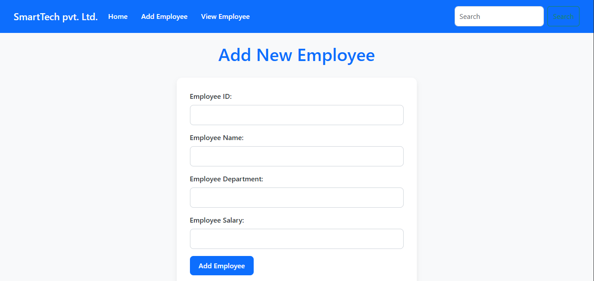
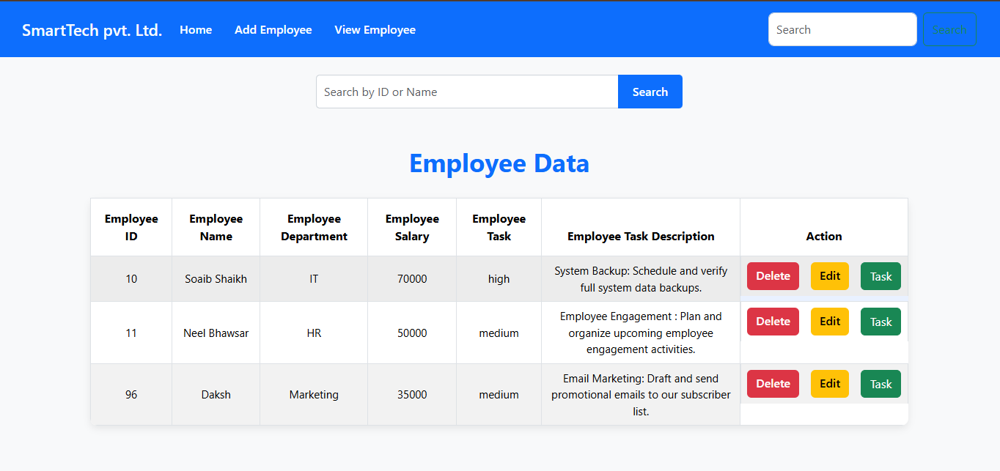

# Employee Management System (Node.js)

A comprehensive Employee Management System built with Node.js, Express, and EJS. This application allows you to add, view, edit, search, assign tasks, and delete employee records, all managed in-memory (no database required). It features a clean UI and is ideal for learning or demonstration purposes.

# Link Here : https://pr-emp-system-node-js.onrender.com

## Table of Contents
- [Features](#features)
- [Technologies Used](#technologies-used)
- [Folder Structure](#folder-structure)
- [Screenshots](#screenshots)
- [Getting Started](#getting-started)
- [Usage](#usage)
- [Notes](#notes)

## Features
- Add new employees
- View all employees
- Edit employee details
- Delete employees
- Search employees
- Assign tasks to employees
- Simple and clean UI with EJS templates
- In-memory data storage (no database setup required)

## Technologies Used
- **Node.js**
- **Express.js**
- **EJS** (Embedded JavaScript Templates)
- **HTML/CSS** (static files served from `public/`)
- **Bootstrap 5** (for responsive UI)

## Folder Structure
```
├── index.js               # Main server file
├── package.json           # Project metadata and dependencies
├── public/                # Static assets (CSS, images, etc.)
│   └── css/
│       └── style.css
├── views/                 # EJS templates
│   ├── edit.ejs
│   ├── header.ejs
│   ├── index.ejs
│   ├── viewdata.ejs
│   └── task.ejs
├── output/                # Screenshots for documentation
│   ├── add-emp.png
│   ├── view-emp.png
│   ├── edit-emp.png
│   ├── delete-emp.png
│   └── search-emp.png
```

## Screenshots

1. Add Employee

   

2. View Employees Data

   

3. Edit Employee

   

4. Delete Employee

   

5. Search Employee

   

## Getting Started

### Prerequisites
- [Node.js](https://nodejs.org/) installed

### Installation
1. Clone the repository:
   ```
   git clone https://github.com/Soaib-Shaikh/PR-Emp-System-Node.js.git
   ```
2. Navigate to the project directory.
3. Install dependencies:
   ```
   npm install
   ```

### Running the Application
Start the server with:
```
node index.js
```

The app will be available at [http://localhost:8081](http://localhost:8081)

## Usage
- Go to the home page to add a new employee.
- View all employees at `/viewdata`.
- Edit or delete employees from the view page.
- Assign tasks to employees using the task assignment form.
- Search for employees by name, department, or other criteria.

## Notes
- All data is stored in memory. Restarting the server will clear all employee records.
- This project is for learning/demo purposes and does not use a database.
- You can customize the UI by editing the EJS templates and CSS files.

